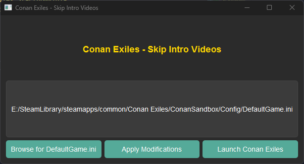

  # Conan Exiles Skip Intro Movies 📝  
  This script will edit the DefaultGame.ini file to disable the startup intro videos in Conan Exiles PC game.  

  ## Screenshot

  
  ## Get Started 🚀  
  -  Start the app
  - Browse to the DefaultGame.ini file
  - Click the "Apply Modifications" button
  - Enjoy Conan without the intro movies
  
  ## Requirements
  - Python 3.11+
  - Install dependencies with this line:
    pip install -r requirements.txt
      
  ## Other Info ✨  
 This script should work on Windows, Mac, and Linux.
 A "ready to run" version is also included for Windows.

 Also included is a PowerShell script (ps_skip_intros.ps1) to accomplish the same thing.

## License

# IDGAF License

Permission is hereby granted, free of charge, to any person obtaining a copy of this software and its documentation files ("the Software"), to deal in the Software without restriction, including without limitation the rights to use, copy, modify, merge, publish, distribute, sublicense, and/or sell copies of the Software.

**THE SOFTWARE IS PROVIDED "AS IS," WITHOUT WARRANTY OF ANY KIND, EXPRESS OR IMPLIED, INCLUDING BUT NOT LIMITED TO THE WARRANTIES OF MERCHANTABILITY OR FITNESS FOR A PARTICULAR PURPOSE.**

**IN NO EVENT SHALL THE AUTHORS OR COPYRIGHT HOLDERS BE LIABLE FOR ANY CLAIM, DAMAGES, OR OTHER LIABILITY, WHETHER IN AN ACTION OF CONTRACT, TORT OR OTHERWISE, ARISING FROM, OUT OF OR IN CONNECTION WITH THE SOFTWARE OR THE USE OR OTHER DEALINGS IN THE SOFTWARE.**

## Clear Conditions

### Zero Requirement
You are granted all permissions without any conditions. You do not need to retain, reproduce, or include any copyright notice or a copy of this license when you redistribute the Software.

### Total Waiver of Liability
By choosing to use, copy, or modify the Software in any way, you are agreeing to completely and permanently release the original author(s) from all liability. If anything goes wrong, you are entirely responsible.

---

**END**
